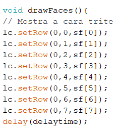

<h2 align='center'>
  Testando a plataforma Wokwi 
</h2>
<h3>
  Visão geral 
</h3>

  

Você irá brincar com a Matriz de LED Escrevendo alguma coisa e aparecendo no Letreiro.

Voce ira aprender:
<ul>
    <li>Instalar uma biblioteca no Arduino IDE.</li>  
</ul>

  <h2 align='center'>Começando...</h2>
      <h3>Componentes utilizados</h3>
      <ul>
    <li>8x24 LED Dot Matrix with MAX7219 Controller

</li> 
    <li>Arduino Uno.

</li> 
</ul>
    <h3>Conexões</h3>
      
As conexões do outro lado do módulo do Led não serão feitas, pois nosso objetivo é usar apenas uma matriz de 8x8.

      <table border="3" align='center'>
    <tr>
        <td><b>Pinos Led</b></td>
        <td><b>Pinos Arduino</b></td>
    </tr>
    <tr>
        <td align='center'>VCC</td>
        <td align='center'>5V</td>
    </tr>
    <tr>
        <td align='center'>GND</td>
        <td align='center'>GND</td>
    </tr>
    <tr>
        <td align='center'>DIN</td>
        <td align='center'>Pin 11</td>
    </tr>
    <tr>
        <td align='center'>CS</td>
        <td align='center'>pin 10</td>
    </tr>
    <tr>
        <td align='center'>CLK</td>
        <td align='center'>pin 13</td>
    </tr>
</table>
<h3 align='center'>Letreiro</h3>

 Logo abaixo tem o código de um letreiro que mostra um o texto que você quiser, mas antes de executarmos esse código temos que instalar a biblioteca <code>Max72xxPanel.h</code> para o código funcionar. Para fazer isso é muito facil, basta você clicar <a href="https://embarcados.com.br/wokwi-simulador-de-esp32/#O-que-e-o-Wokwi
">nesse link</a> para baixar a pasta compactada da biblioteca, uma vez feito isso vamos para o Arduino IDE e procurar por <code>Sketch</code> > <code>Incluir bibliioteca</code> > <code>Adicionar .ZIP</code> .

 Procure pela pasta baixada e clique em <code>abrir</code>

 Agora iremos instalar outra biblioteca <code> Adafruit GFX Library</code>, dessa vez iremos utilizar outra forma de instalar, basta clicar em <code>Ferramentas</code> > <code>Gerenciar bibliotecas</code>.

 Procure por <code> Adafruit GFX Library</code> e instale.

 Pronto agora uma vez que as conexões estão feitas execute o código abaixo:

<pre><code >
#include "SPI.h"
#include "Adafruit_GFX.h"
#include "Max72xxPanel.h"
 
int pinCS = 10; // Conecte CS a este pino, DIN(11) a MOSI e CLK(13) a SCK
int numberOfHorizontalDisplays = 1;
int numberOfVerticalDisplays = 3;
 
Max72xxPanel matrix = Max72xxPanel(pinCS, numberOfHorizontalDisplays, numberOfVerticalDisplays);
 
String txtDisplay = "ETEFMC";
int width = 5 + 1; // A largura da fonte é de 5 pixels
 
void setup() 
{
 
  matrix.setIntensity(15); // Use um valor entre 0 e 15 para brilho
  matrix.setPosition(0, 0, 0); // A primeira exibição está em <0, 0>
  matrix.setPosition(1, 0, 1); // A segunda tela está em <1, 0>
  matrix.setPosition(2, 0, 2); // A terceira tela está em <2, 0>
  matrix.setRotation(1);    // A mesma espera para a última exibição
 matrix.fillScreen(LOW);
 matrix.write();
 delay(400);
 matrix.print("ETE");
 matrix.write();
 delay(2000);
}
 
void loop() 
{
  for ( int i = 0 ; i < width * txtDisplay.length() + matrix.width() - 1 - 1; i++ ) 
  {
    matrix.fillScreen(LOW);
 
    int letter = i / width;
    int x = (matrix.width() - 1) - i % width;
    int y = (matrix.height() - 8) / 2; // centraliza o texto verticalmente
 
    while ( x + width - 1 >= 0 && letter >= 0 ) 
    {
      if ( letter < txtDisplay.length() ) 
      {
        matrix.drawChar(x, y, txtDisplay[letter], HIGH, LOW, 1);
      }
      letter--;
      x -= width;
    }
 
    matrix.write(); // Envia bitmap para exibição
    delay(100);
  }
}</code></pre>

Espere o seguinte resultado:

<h3 align='center'>
  Testando na prática
</h3>

  
Agora vamos testar na prática o que fizemos no simulador, iremos precisar dos mesmos componentes, serão as mesmas conexões e utilizaremos o Arduino IDE.

1. Monte seu circuito na prática fazendo as mesmas conexões

2. Copie e cole o código para o Arduino IDE.

3. Selecione a porta <code>COM</code>

4. Execute o código.

 Espere o seguinte resultado:

<h3 align='center'>
  Explicando o código
</h3>
<h4 align='center'>Usando as funções da biblioteca LedControl</h4>

A maneira mais fácil de exibir algo na matriz de pontos é usando as funções <code>setLed()</code> , <code>setRow()</code> ou <code>setColumn()</code> . Estas funções permitem controlar um único led, uma linha ou uma coluna de cada vez.

Aqui estão os parâmetros para cada função:

<b>setLed(addr, linha, coluna, estado)</b>
<ul>
    <li><code>addr</code> é o endereço da sua matriz, por exemplo, se você tiver apenas 1 matriz, o int addr será zero.</li>  
    <li><code>linha</code> é a linha onde o led está localizado.</li>  
<li><code>col</code> é a coluna onde o led está localizado</li>  
<li><code>Estado</code> <ul><li>É verdadeiro ou 1 se quiser acender o led</li><li>É falso ou 0 se você quiser desligá-lo</li></ul></li> 
</ul>
<b>setRow(addr, linha, valor)</b>

<b>setCol(addr, coluna, valor)</b>

<h4 align='center'>byte arrays</h4>

 Essas Arrays de Bytes são o que informa os pontos gráficos(Led's) que serão acionados no Display 

<code>lc.shutdown(0,false);</code> Liga o Display.

<code>lc.setIntensity(0,8);</code> Configura o brilho do Display, sendo o máximo 15 e o mínimo 0.

<code>lc.clearDisplay(0);</code> Limpa o display após liga-lo.

<code>void drawFaces(){</code> é uma função void onde mostra a cara triste, neutra e feliz.

<code>lc.setRow(0,0,sf[0]);</code> A função setRow(addr,row,value) recebe 3 argumentos. O primeiro é o endereço do dispositivo. O segundo é a linha que precisa ser atualizada e o terceiro é o valor a ser definido para esta linha.

<code>delay(delaytime);</code> Tempo de delay, nesse caso 1 segundo entre as faces, foi atribuido á uma variável global mas poderia ser o valor numérico em milissegundos normal.

<code>void loop(){</code> Executa o código em loop.

<code>drawFaces();</code> Executa o código que está na função que acabamos de criar <code>void drawFaces(){</code>.
